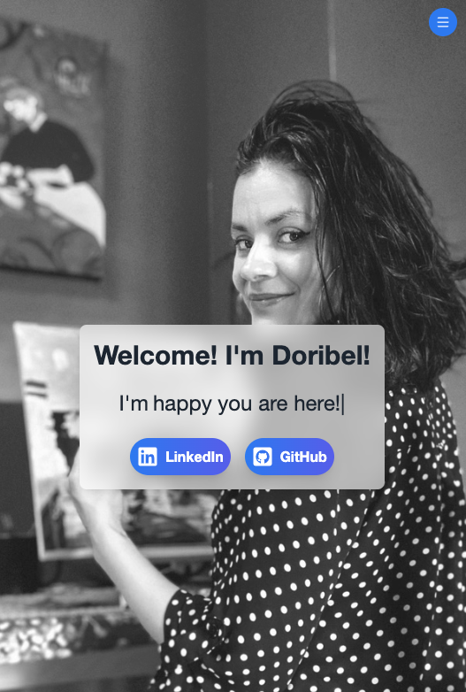
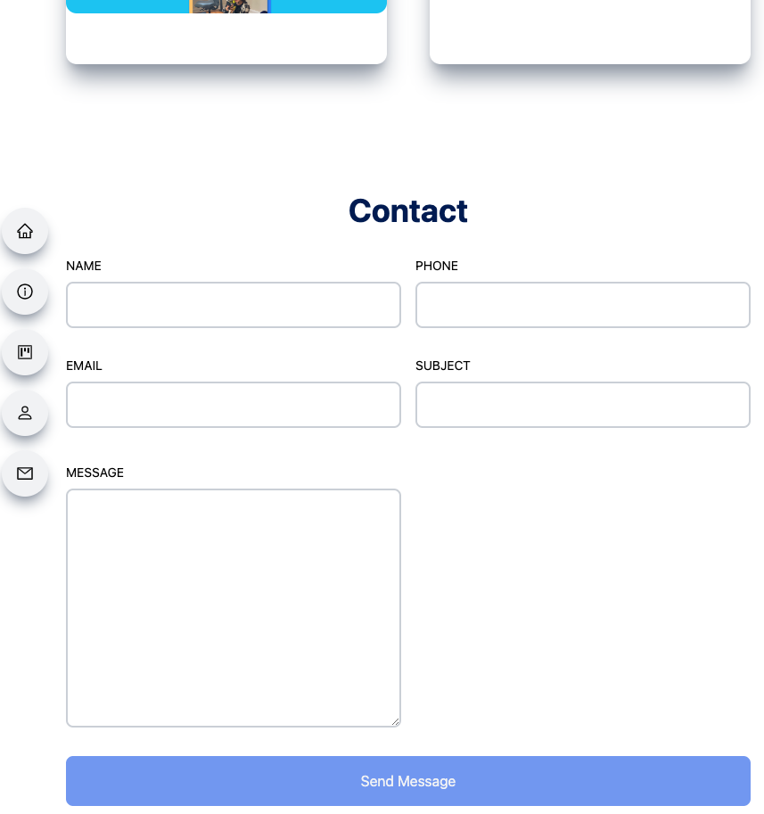

# `Doribel React Portfolio`
***

#### [Portfolio Link](https://doribel-portfolio.netlify.app/#main)
---
#### `Description`
#####  
---
#### `Technology`

***

##### `Attributions Links`

- [x] [app.getform.io](https://app.getform.io/forms)  
- [x] [Code Commerce](https://www.youtube.com/watch?v=22CxRxryQFE)  

